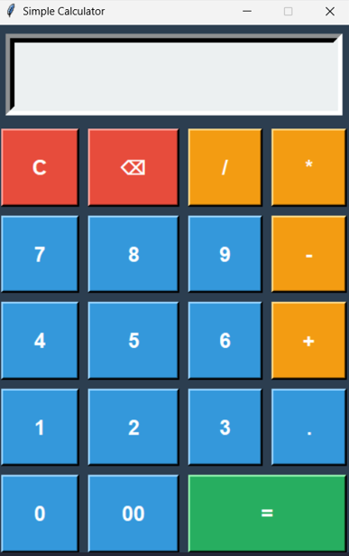

# Python Calculator 🧮

A modern, user-friendly GUI calculator built with Python and Tkinter as my first GitHub project.

## 📖 About This Project

This calculator application was developed as part of my learning journey in Python programming during my B.Tech 1st year. It demonstrates fundamental programming concepts including GUI design, event handling, and arithmetic operations.

## ✨ Features

- **Basic Arithmetic Operations**: Addition, subtraction, multiplication, and division
- **User-Friendly Interface**: Modern, colorful design with responsive buttons
- **Clear Function**: Reset the calculator with a single click
- **Backspace Function**: Delete the last entered character
- **Decimal Support**: Perform calculations with decimal numbers
- **Error Handling**: Displays error messages for invalid operations

## 🛠️ Technologies Used

- **Python 3.x**: Core programming language
- **Tkinter**: GUI framework for creating the interface

## 📋 Requirements

- Python 3.x or higher
- Tkinter (comes pre-installed with Python)

## 🚀 How to Run

1. **Clone this repository**:
```bash
   git clone https://github.com/swayampakulanarayanakousik-arch/python-calculator.git
```

2. **Navigate to the project directory**:
```bash
   cd python-calculator
```

3. **Run the calculator**:
```bash
   python calculator.py
```

## 📸 Screenshots

()


## 💡 What I Learned

Through this project, I gained hands-on experience with:
- Python programming fundamentals
- GUI development using Tkinter
- Event-driven programming
- Git version control and GitHub workflow
- Code organization and documentation

## 🔮 Future Enhancements

- [ ] Add keyboard support for number input
- [ ] Implement scientific calculator functions (sin, cos, tan, etc.)
- [ ] Add calculation history feature
- [ ] Include memory functions (M+, M-, MR, MC)
- [ ] Add themes (light/dark mode)

## 👨‍💻 Author

- SWAYAMPAKULA NARAYANA KOUSIK
- B.Tech 1st Year Student(2026)
- College: VIT-AP University
- GitHub: [@swayampakulanarayanakousik-arch](https://github.com/swayampakulanarayanakousik-arch)
- Email: swayampakulanarayanakousik@gmail.com
- LinkedIn: [narayanakousik](https://www.linkedin.com/in/narayanakousik/)

## 🙏 Acknowledgments

- Thanks to my parents for their support
- Python and Tkinter documentation
- Online coding communities for inspiration and support

## 📝 License

This project is open source and available for learning purposes. Feel free to fork, modify, and use it for your own learning journey!

## 🤝 Contributing

If you have suggestions for improvements or find any bugs, feel free to:
1. Fork the repository
2. Create a new branch (`git checkout -b feature/improvement`)
3. Make your changes
4. Commit your changes (`git commit -m 'Add some feature'`)
5. Push to the branch (`git push origin feature/improvement`)
6. Open a Pull Request

## 📞 Contact

Feel free to reach out if you have any questions or suggestions!
- Gmail: swayampakulanarayanakousik@gmail.com
- Instagram: narayanakousik

⭐ If you found this project helpful, please consider giving it a star!

**Made with ❤️ by Narayana Kousik** | © 2026